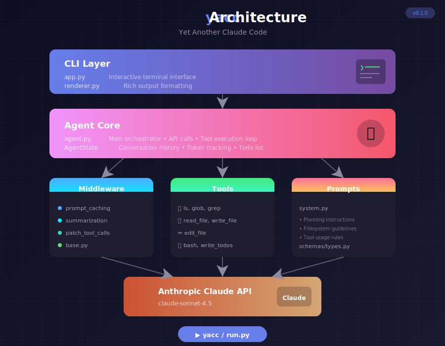

# 🚀 Yet Another Claude Code

<div align="center">

**A minimal, elegant AI coding assistant powered by Claude**

[](https://python.org)
[](https://anthropic.com)
[](LICENSE)

</div>

---

## ✨ Features

- 🤖 **AI-Powered** — Claude Sonnet 4.5 for intelligent code assistance
- 💻 **Beautiful CLI** — Rich terminal interface with colors, spinners & real-time output
- 📋 **Task Planning** — Built-in todo management for complex tasks
- 🔧 **File Operations** — Read, write, edit files with syntax awareness
- ⚡ **Lightweight** — Pure Python, no LangChain dependency
- 🔄 **Context Management** — Auto-summarization & prompt caching

---

## 🏗️ Architecture

<div align="center">
  
</div>

---

## 📦 Installation

```bash
# Clone the repository
git clone https://github.com/SeungyounShin/yet-another-claude-code.git
cd yet-another-claude-code

# Install the package
pip install -e .
```

## 🚀 Quick Start

```bash
# Set your API key
export ANTHROPIC_API_KEY="your-api-key"

# Start interactive mode
yacc

# Or run a single command
yacc "Create a hello world script"
```

## 💡 Usage

```bash
# Interactive mode (default)
yacc

# Single command
yacc "Refactor this function to be more efficient"

# Specify workspace
yacc -w /path/to/project "Analyze the codebase"

# Show help
yacc --help
```

### CLI Commands

| Command | Description |
|---------|-------------|
| `exit` | Exit the CLI |
| `clear` | Clear screen |
| `reset` | Reset conversation |
| `todos` | Show current tasks |
| `help` | Show help |

---

## 📸 Demo

<div align="center">
  
</div>

---

## 🛠️ Built-in Tools

| Tool | Description |
|------|-------------|
| `ls` | List directory contents |
| `read_file` | Read file with pagination |
| `write_file` | Create or overwrite files |
| `edit_file` | Precise string replacements |
| `glob` | Find files by pattern |
| `grep` | Search text in files |
| `bash` | Execute shell commands |
| `write_todos` | Manage task lists |

---

## 📋 Requirements

- Python 3.10+
- Anthropic API Key

## 📄 License

MIT © [SeungyounShin](https://github.com/SeungyounShin)
